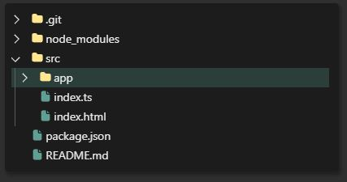

# Recomp

React Component Library

Storybook: `packages/recomp-storybook/`

---

This is a library I created mainly for use in a personal note-taking application.
It includes UI components, hooks, styles, and utilities for creating a react frontend.

It is created with react, sass, and typescript. It also uses vite and storybook.
Other modules include external libraries such as monaco, css-doodle, katex, prism, react-spring, immer, fuzzysort, and dnd-kit.

---

## Elements

- **Action:** A styled button that highlights when hovered, intended for icons
- **Alert:** Element which can be used for popup notifiaction overlays
- **Block:** Nestable container element used to bring attention to some UI content
  - 
- **Board:** Window dialog component (with header, control buttons, body, and footer actions)
- **Cabinet:** A container with the ability to expand/collapse visability (ex: spoiler)
  - 
- **Entry:** A styled div with similar styling to an input field, used for custom inputs
- **Popover:** A popover element used to display UI absolutely positioned around a target
- **Quote:** A styled element containing blockquote and cite html elements
- **Switch:** A styled checkbox
- **Tooltip:** A styled element with text content pointing towards some target
- ...other basic html elements as a react component with custom styling or props

## Components

- **Coast:** A stylistic sidebar with fluid active indicator & tooltip motion (inspired by VSCode)
  - 
- **Color:** A color hex field with a popover color picker when clicked
- **Doodle:** React component for "css-doodle"
- **DropZone:** A drop/upload element for dropping files & images
- **Edge:** Vertical tabs with grouping and ordering, with fluid animations and tooltips (inspired by Microsoft Edge vertical tabs)
  - 
- **Emoji:** Component for including standard and animated emoji's (referencing emojipedia)
- **FlashCard:** N-sided flashcards
- **Folder:** Collapsible folder component with support for moving/selecting items (inspired by VSCode explorer)
  - 
- **Herald:** Notification overlay component for handling pushing animated notifications
- **Katex:** React component for "KaTeX" math formula display library
- **Menu:** Context menu with support for submenus
  - 
- **Monaco:** React component for "Monaco" code editor (code editor used in VSCode)
  - 
- **Prism:** React component for "Prism" syntax-highlighted code display
- **Seek:** Component used to display search results (inspired by modern search UI like Algolia)
- **Titlebar:** Component for desktop windowed titlebars, with menubar, header, and control bar

## Containers

- **Bar:** For positioning content along bar (start, center, end)
- **Overlay:** Overlay with tint and blur styling options
- **Scroll:** Scroll container
- **Split:** A split-pane react component with support for snapping, orienting, and custom positioning/sizing

## Packages

- **Animate:** Animation hooks and utilities
- **Chroma:** Color utility for converting rgb/hsl/hex formats and executing color mixins and math functions in javascript
- **Hooks:** Commonly used hooks including wrappers: useImmer (immer) useSearch (fuzzysort)
- **Icons:** React components of commonly used SVG icons
